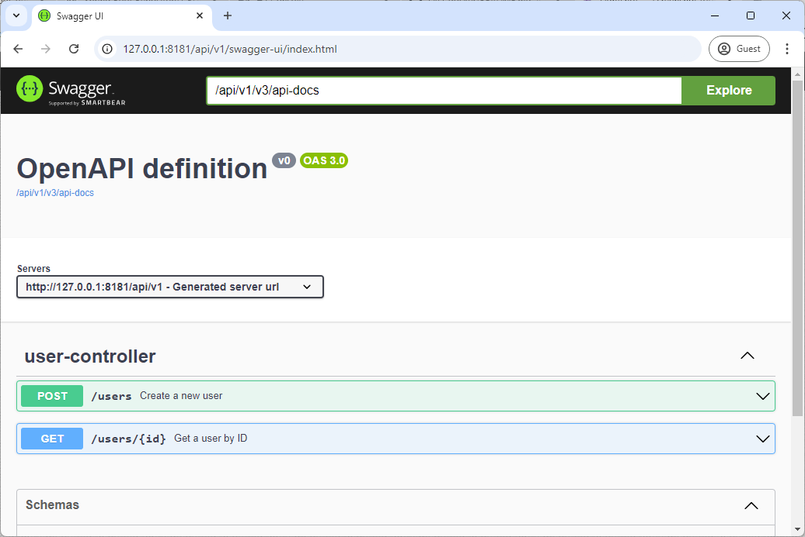
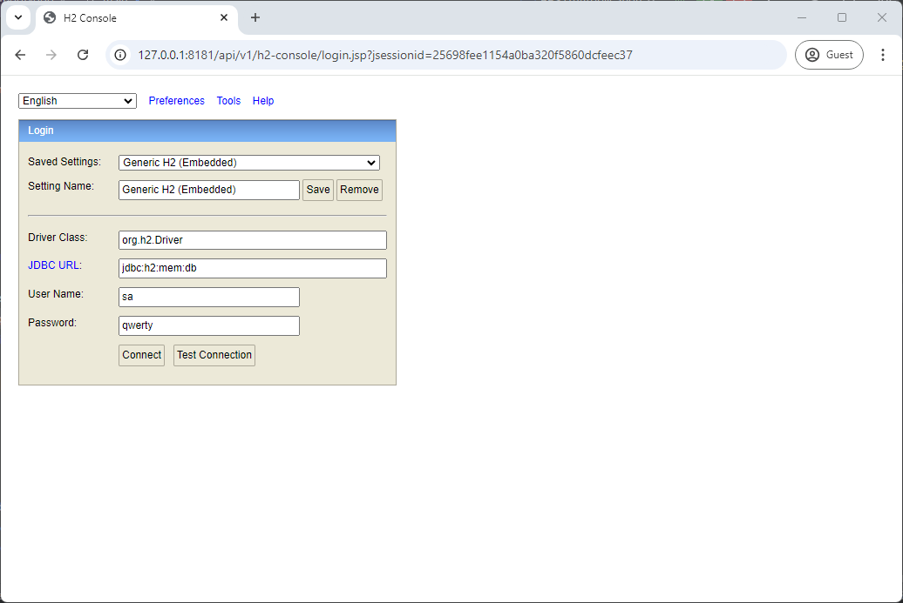
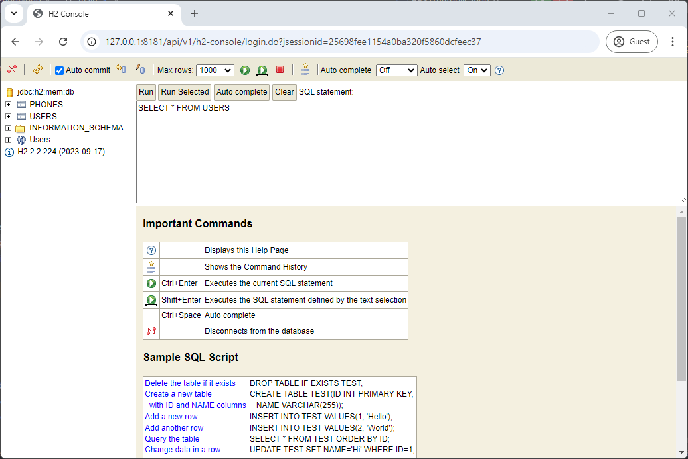
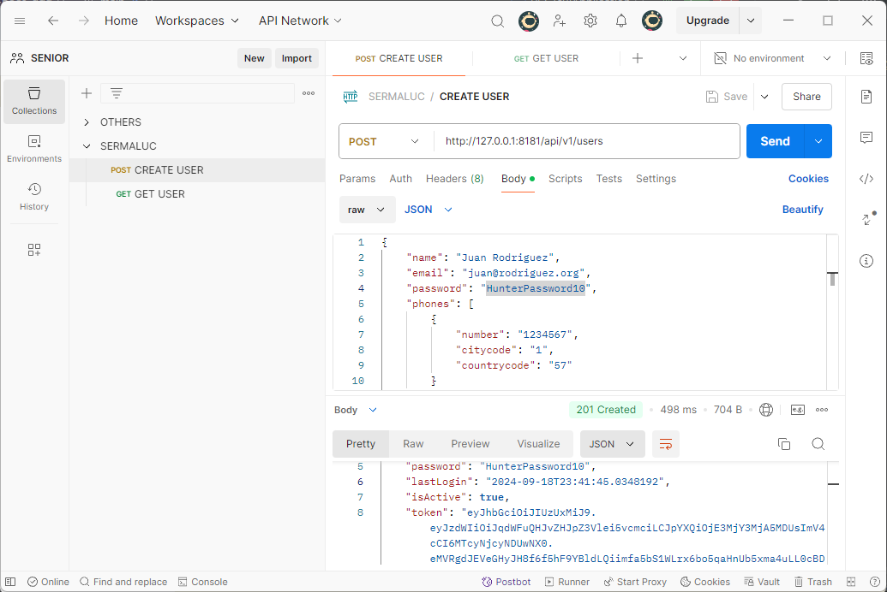
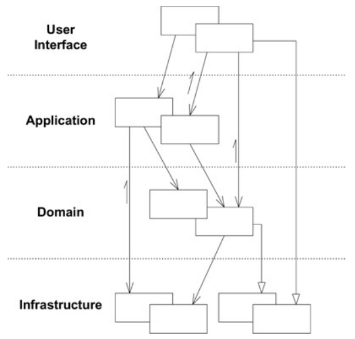

# Guía de ejecución del Proyecto

Este proyecto es una API RESTful basada en Spring Boot que maneja usuarios y teléfonos con persistencia en una base de datos H2.

## Índice

1. [Pre-requisitos](#pre-requisitos)
2. [Compilar el Proyecto](#compilar-el-proyecto)
3. [Desplegar en Docker](#desplegar-en-docker)
4. [Ejecutar Pruebas Unitarias](#ejecutar-pruebas-unitarias)
5. [Validar Swagger, H2 y Postman](#validar-swagger-h2-y-postman)
6. [Diagrama Proyecto](#diagrama-proyecto)

## Pre-requisitos

Antes de comenzar, asegúrate de tener instaladas las siguientes herramientas:

- [Java 17](https://www.oracle.com/java/technologies/javase-jdk17-downloads.html)
- [Maven 3.8.8](https://maven.apache.org/download.cgi)
- [Docker](https://www.docker.com/products/docker-desktop)
- [Docker Compose](https://docs.docker.com/compose/install/)

## Compilar el Proyecto

1. **Clona el repositorio:**

   ```bash
   cd sources
   git clone https://github.com/seniorpe/java-spring-boot-ddd.git
   
   
2. **Compilar el proyecto usando Maven:**

   ```bash
   cd java-spring-boot-ddd
   mvn clean install -DskipTests
   
 Esto descargará las dependencias, compilará el código fuente y ejecutará sin las pruebas unitarias.

## Desplegar en Docker

1. **Asegúrate de que Docker se encuentre funcionando.**
   
2. **Desplegar en Docker**

   ```bash
   docker build -t java-spring-boot-ddd .
   docker run -d -p 8181:8181 java-spring-boot-ddd
   
3. **Validar despliegue**
   ```bash
      docker ps

## Ejecutar Pruebas Unitarias

1. **Ejecuta los tests:**

   ```bash
   mvn test
   
Esto ejecutará todas las pruebas unitarias.

## Validar Swagger, H2 y Postman
1. **Swagger**
   ```bash
   URL: http://127.0.0.1:8181/api/v1/swagger-ui/index.html


   
2. **H2 Console**
   Las tablas de la base de datos se generan al desplegar el proyecto. El archivo DDL está en: resources/db/create.sql
   ```bash
   URL: http://127.0.0.1:8181/api/v1/h2-console

   Driver Class: org.h2.Driver
   JDBC URL: jdbc:h2:mem:db
   User Name: sa
   Password: qwerty
      




3. **Postman**
   Se debe importar a Postman el fichero de la colección que está dentro del proyecto.
   ```bash
   resources/postman/RESTful.postman_collection
   


## Diagrama Proyecto
Este proyecto está basado en Domain-Driven Design (DDD), un enfoque que organiza el código en torno al dominio del negocio. El sistema se divide en diferentes Bounded Contexts, cada uno representando una parte específica del dominio. Las entidades, agregados, servicios de dominio y repositorios son utilizados para garantizar que el modelo refleje con precisión el conocimiento del negocio, facilitando el desarrollo y mantenimiento del sistema a medida que evoluciona.


